# PortalMod: Pneumatics
AKA Pneumatic Diversity Vents / `pneumaticdiversityvents`

Pneumatic Diversity Vents is a Minecraft Forge 1.16.5 mod that adds modular Pneumatic Diversity Vents from the Portal franchise. Vent networks can move players and supported entities, detect traffic with scanners, and route traffic through powered junctions.

## Requirements

- Minecraft 1.16.5
- Forge 36.2.34
- Java 8
- PortalMod 1.3.1

The development PortalMod dependency is provided in `libs/portalmod-1.3.1.jar`.

## Items
### Pneumatic Diversity Vent
`pneumaticdiversityvents:vent_segment`

> Aperture's patented steel-and-glass tubing capable of holding a vacuum.

Segments connect linearly to form airtight vent networks.

- Normal placement creates a one-block-long, 2x2 vent segment.
- Crouch-place a segment onto the open end of an existing one-long segment to extend it into a two-block-long segment.
- Crouch-place against an appropriate side of a two-long segment to bend or reroute that section while continuing the network.
- The segment itself has no wrench configuration.

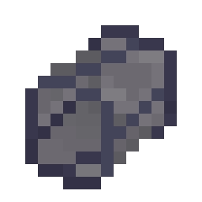
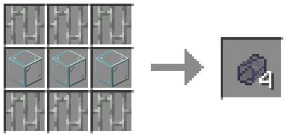

### Pneumatic Encouragement Impeller
`pneumaticdiversityvents:vent_impeller`

> The Encouragement Impeller removes non-essential social barriers from the Diversity Vent's interior, such as 'atmospheric pressure', and 'breathable air'.

Adds airflow to the connected vent network. Each impeller contributes force in its configured direction; multiple impellers combine through the network.

- Wrench-click reverses the impeller's configured polarity/direction.
- By default an impeller runs continuously.
- When connected to PortalMod antline/indicator control, crouch-wrench cycles between:
  - **On/off:** powered = running, unpowered = stopped.
  - **Reverse when powered:** unpowered = normal polarity, powered = reversed polarity.

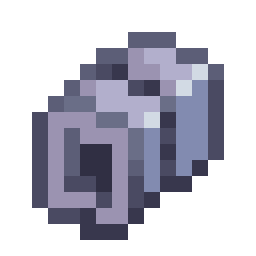
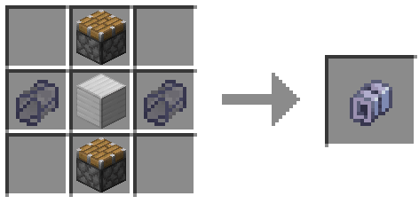

### Diversity Focusing Collar
`pneumaticdiversityvents:vent_terminal`

A focused open endpoint. It narrows and strengthens the external intake/exhaust field compared with an ordinary open vent end.

Wrench-click cycles the terminal indicator through three modes:

- **Standard:** no status light.
- **Force:** lights while the connected network has active non-zero airflow.
- **Player:** lights when airflow is strong enough for player transport.

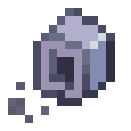
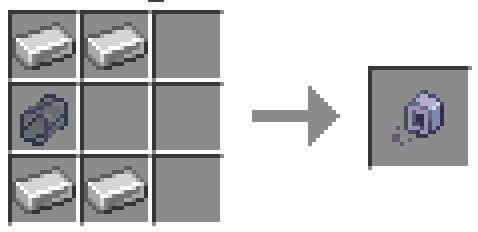

### Encased Pneumatic Diversity Vent
`pneumaticdiversityvents:vent_encased`

A one-block-long vent with a full outer shell. Internally it behaves like a normal straight vent segment, but it is intended as a visually enclosed section.

- It cannot be extended into a two-long section or rerouted into a bend.
- It has no wrench configuration.

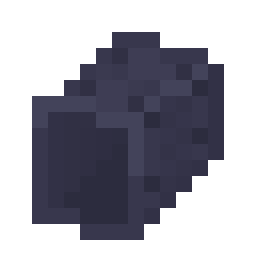
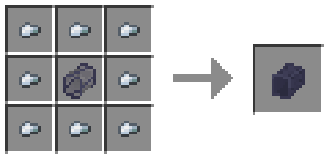

### Diversity Identifier
`pneumaticdiversityvents:vent_scanner`

> "Passive Monitoring" ensures objects in vent are identified, but never judged.
Detects cubes or test subjects passing through its tunnel and emits a short activation pulse to connected PortalMod antlines.

- Wrench-click switches the detection target between **PortalMod cubes** and **players**.
- When a new matching target crosses the scanner, it activates for one second (20 ticks).

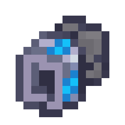
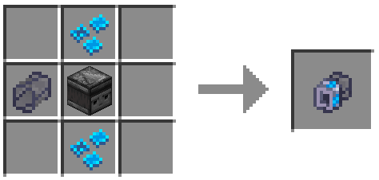

### Non-Discriminatory Vent Redirector
`pneumaticdiversityvents:vent_junction`

A powered T-junction that chooses between a straight route and a 90-degree branch. Internally it remains a two-ended vent edge rather than creating a permanent three-way graph split.

- Place it as part of a vent network to establish the straight axis and alternate branch.
- Crouch-place a compatible vent item against an unused side face to reorient the branch toward that side while continuing the route.
- Wrench-click toggles which of the two straight axial faces is the fixed side.
- Crouch-wrench toggles whether the **straight** or **turn** route is the default while unpowered.
- Connected PortalMod indicator/antline power swaps the active route away from the configured unpowered default.

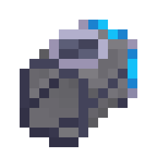
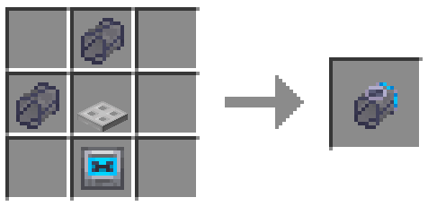

## Achievements

### Too Fast, Too Factory

Hit the speed cap while traveling through a Diversity Vent.
> _This is a reference to the Satisfactory achievement of the same name acquired by hitting high speeds using the HyperTube._

### Don't Tell OSHA

Fall to your death from a Pneumatic Diversity Vent.
> _This is a reference to what I was doing on November 5, 1983._

## Misc. Features

### Airflow GUI

Looking at a vent segment while holding the PortalMod wrench makes visible a HUD element which displays air speed across the network, airflow direction, and whether the network is capable of carrying the player.

Additionally, this GUI element will display 'NO NET AIRFLOW' or 'BLOCKED' text to explain why there is no airflow across the network.

### PortalMod Support

A number of PortalMod integrations have been made on top of basic antline support.

- When a portal is placed within a vent's outward suction zone, the suction force is passed through the portal, creating a force-field at the other end of the portal. The shape of this field is specialized to pull in entities from _around_ the portal rather than just immediately in front of it, in keeping with the behavior we see in the Portal 2 E3 diversity vent demo.
- Turrets become 'toppled' when they enter the diversity vent.
- (While not technically an integration) a number of PortalMod sounds are used in this mod to keep the soundscape consistent. Also because Audacity crashed without saving.
- As mentioned above, the PortalMod wrench is used to configure vent components and inspect airflow across a network.

## Build

```sh
./gradlew build
```

The reobfuscated mod JAR is produced under `build/libs/`.

## Development

The mod ID and resource namespace are `pneumaticdiversityvents`.

`ARCHITECTURE.md` documents the network model, placement/update flow, transport system, external forces, PortalMod integration, and extension points. Junction blockstate/model assets can be regenerated with `tools/generate_junction_assets.py`.

## Project structure

- `src/main/java/.../client` — client rendering, sounds, inspection UI, and smoke particles.
- `src/main/java/.../server` — network topology, world updates, transport, external forces, and integrations.
- `src/main/java/.../shared` — blocks, items, common state, geometry, and shared world types.
- `src/main/resources` — blockstates, models, textures, language, recipes, tags, particles, and advancements.
- `tools` — deterministic resource-generation helpers.

## License

Pneumatic Diversity Vents may be used, modified, and redistributed under the terms in `LICENSE.txt`, provided appropriate credit is given to Benjamin Hume as the original author.
